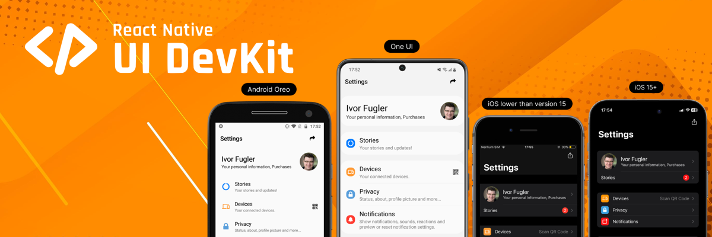
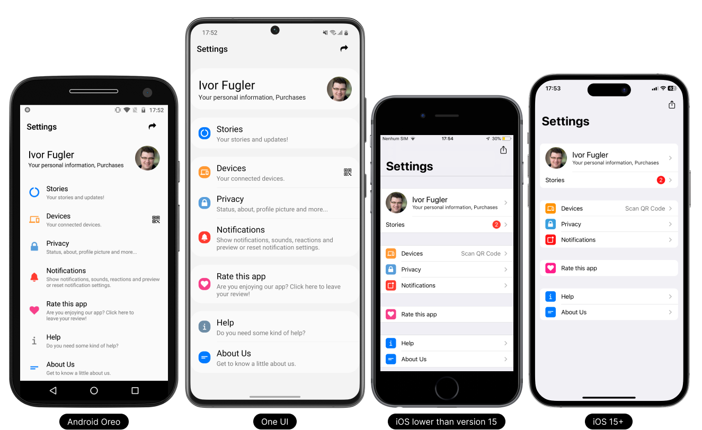

<p align="center">
  <a href="https://reactnativeuidevkit.com/">
    
  </a>
</p>

# Native UI Development Kit for React Native
Before you get started with our React Native UI DevKit package, we'll provide a simplified overview.

## What is React Native UI DevKit?

React Native UI DevKit is a free component library developed with the Native-style concept that delivers a native interface for each platform.

> Action, Button, Card, Checkbox, Collapsible, Divider, FlatList, Icon, Item, List, Radio, Separator, Swipeable (iOS), Switch, TextInput

<p align="center">
  <a href="https://reactnativeuidevkit.com/">
    
  </a>
</p>

## Where does it apply?

React Native UI DevKit components can be used simply and efficiently in your applications developed in React Native.

Transform the experience of users who use or will use your application into a native navigability experience according to the platform and version for Android and iOS.

## Getting started

### Installation

```bash npm2yarn
 npm install react-native-ui-devkit
```
### Peer Dependencies
- **react-native-gesture-handler**: https://www.npmjs.com/package/react-native-gesture-handler
- **react-native-device-info**: https://www.npmjs.com/package/react-native-device-info
- **react-native-vector-icons**: https://www.npmjs.com/package/react-native-vector-icons
- **react-native-sfsymbols**: https://www.npmjs.com/package/react-native-sfsymbols
- **react-native-haptic-feedback**: https://www.npmjs.com/package/react-native-haptic-feedback
- **react-native-reanimated**: https://www.npmjs.com/package/react-native-reanimated

Refer to the documentation for each package. Each package has its own installation instructions that should be followed to ensure a correct and smooth integration. Keep in mind that the individual installation guidelines for each package are essential for the success of the project.

```bash npm2yarn
 npm install react-native-gesture-handler react-native-device-info react-native-vector-icons react-native-sfsymbols react-native-haptic-feedback react-native-reanimated
```
From React Native 0.60 and higher, linking is automatic. So you don't need to run react-native link.

If you're on a Mac and developing for iOS, you need to install the pods [(via Cocoapods)](https://cocoapods.org/) to complete the linking.

```bash 
 cd ios && pod install
```

### Provider

The provider has to be imported and has to wrap its routes due to Native-style and light and dark modes.

```tsx
import React from 'react';
import { NavigationContainer } from '@react-navigation/native';
import { createNativeStackNavigator } from '@react-navigation/native-stack';

// React Native UI DevKit
import { RNUIDevKitProvider, Item } from 'react-native-ui-devkit';

const Stack = createNativeStackNavigator();
const App = () => {
  const Component = (props) => {
    return (
      <Item data={{ title: 'Item', onPress: async () => { } }} />
    )
  }

  return (
    <RNUIDevKitProvider theme={'auto'} backgroundColor={'both'} >
      <NavigationContainer>
        <Stack.Navigator>
          <Stack.Screen name="Component" component={Component} />
        </Stack.Navigator>
      </NavigationContainer>
    </RNUIDevKitProvider>
  );
}

export default App;
```

### Test

```bash
 npx react-native run-android
```

## Migrating from your component to React Native UI DevKit components

See how easy it is to migrate your components to the Native-style version of React Native UI DevKit components.

```tsx
// From
import React from "react";
import { Text, TouchableOpacity } from "react-native";

const App = () => {
  return (
    <TouchableOpacity onPress={async () => { }}>
        <Text>Button</Text>
    </TouchableOpacity>
  )
};

export default App;
```

```tsx
// To
import React from "react";

// React Native UI DevKit
import { Button } from "react-native-ui-devkit";

const App = () => {
  return (<Button data={{ title: 'Button', onPress: async () => { } }} />)
};

export default App;
```

## Features

See here all the features that the React Native UI DevKit has.

### Provider
-  [RNUIDevKitProvider](https://reactnativeuidevkit.com/docs/Introduction/Provider)

### Components

-  [Action](https://reactnativeuidevkit.com/docs/Components/Action)
-  [Button](https://reactnativeuidevkit.com/docs/Components/Button)
-  [Card](https://reactnativeuidevkit.com/docs/Components/Card)
-  [Checkbox](https://reactnativeuidevkit.com/docs/Components/Checkbox)
-  [Collapsible](https://reactnativeuidevkit.com/docs/Components/Collapsible)
-  [Divider](https://reactnativeuidevkit.com/docs/Components/Divider)
-  [FlatList](https://reactnativeuidevkit.com/docs/Components/FlatList)
-  [Icon](https://reactnativeuidevkit.com/docs/Components/Icon)
-  [Item](https://reactnativeuidevkit.com/docs/Components/Item)
-  [List](https://reactnativeuidevkit.com/docs/Components/List)
-  [Radio](https://reactnativeuidevkit.com/docs/Components/Radio)
-  [Separator](https://reactnativeuidevkit.com/docs/Components/Separator)
-  [Swipeable (iOS)](https://reactnativeuidevkit.com/docs/Components/Swipeable)
-  [Switch](https://reactnativeuidevkit.com/docs/Components/Switch)
-  [TextInput](https://reactnativeuidevkit.com/docs/Components/TextInput)

### Fonts

-  [TitleFontSize](https://reactnativeuidevkit.com/docs/Fonts/TitleFontSize)
-  [MediumFontSize](https://reactnativeuidevkit.com/docs/Fonts/MediumFontSize)
-  [DescriptionFontSize](https://reactnativeuidevkit.com/docs/Fonts/DescriptionFontSize)

### Functions

-  [useColors()](https://reactnativeuidevkit.com/docs/Functions/useColors)
-  [marginTop()](https://reactnativeuidevkit.com/docs/Functions/marginTop)
-  [marginBottom()](https://reactnativeuidevkit.com/docs/Functions/marginBottom)
-  [marginHorizontal()](https://reactnativeuidevkit.com/docs/Functions/marginHorizontal)
-  [paddingTop()](https://reactnativeuidevkit.com/docs/Functions/paddingTop)
-  [paddingBottom()](https://reactnativeuidevkit.com/docs/Functions/paddingBottom)
-  [paddingHorizontal()](https://reactnativeuidevkit.com/docs/Functions/paddingHorizontal)
-  [borderRadius()](https://reactnativeuidevkit.com/docs/Functions/borderRadius)
-  [androidOldVersion()](https://reactnativeuidevkit.com/docs/Functions/androidOldVersion)
-  [iosOldVersion()](https://reactnativeuidevkit.com/docs/Functions/iosOldVersion)


## Library

The React Native UI DevKit Library is a project that covers the use of all components of the [React Native UI DevKit](https://reactnativeuidevkit.com) package in addition to the light and dark theme. You can use it to check the behavior of each component in the real world and facilitate implementation in your projects.

[Learn more...](https://github.com/reactnativeuidevkit/react-native-ui-devkit-library)


## Layout

The React Native UI DevKit Layout is a project that includes the use of some standard layouts in applications. You can use some ready-made layouts to have a starting point and facilitate implementation in your projects.

[Learn more...](https://github.com/reactnativeuidevkit/react-native-ui-devkit-layout)


## Continuous Innovation

The React Native UI DevKit continuous innovation protocol is constantly evolving through research and development. It consists of two steps: the first is the analysis of the Android and iOS platforms and their versions and updates, to test and deploy the latest updates. The second is our testing ground to validate new features and improvements before they are implemented in the React Native UI DevKit package update.

## Contributing

If you have any questions, suggestions or complaints please send us an email at feedback@reactnativeuidevkit.com.

## License

Licensed under The MIT License.<br />Copyright © 2023 React Native UI DevKit - All rights reserved.

See [license](./LICENSE) for more information.